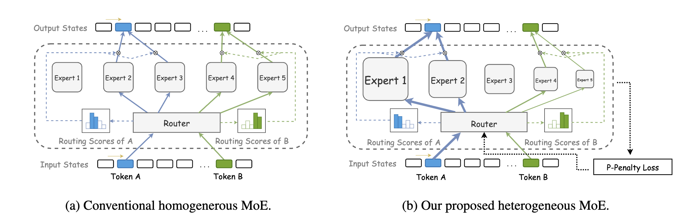

# HMoE: Heterogeneous Mixture of Experts

[](https://arxiv.org/abs/2408.10681)
[](https://opensource.org/licenses/BSD-3-Clause)
[](https://www.python.org/)
[](https://pytorch.org/)

## Overview

HMoE (Heterogeneous Mixture of Experts) is a large language model implementation based on heterogeneous expert mixture architecture. Built on the TorchTitan framework, it implements expert networks with different hidden layer dimensions, achieving more efficient model training and inference through dynamic routing mechanisms.

## Model Design



### Key Features

- **Heterogeneous Expert Architecture**: Supports expert networks with different hidden layer dimensions for enhanced model expressiveness
- **Load Balancing**: Supports expert load balancing and p-penalty loss functions
- **Distributed Training Support**: Supports FSDP and other parallelization strategies
- **Flexible Configuration**: Supports various model scales and training configurations

## Quick Start

### Prerequisites

- Python 3.12+
- CUDA 12.6+
- PyTorch (nightly build)
- Other dependencies as specified in `scripts/init/deps.sh`

### Installation

1. **Clone the repository**
   ```bash
   git clone <repository-url>
   cd hmoe
   ```

2. **Install environment dependencies**
   ```bash
   sh scripts/init/deps.sh
   ```

3. **Download tokenizer**
   ```bash
   python 3rdparty/torchtitan/scripts/download_hf_assets.py \
       --repo_id deepseek-ai/deepseek-moe-16b-base \
       --assets tokenizer
   ```
   
   > **Note**: We use the tokenizer from deepseek-ai/deepseek-moe-16b-base to help users test and run the HMoE model.

4. **Download demo dataset**
   ```bash
   python scripts/dataset/download_fineweb-edu.py
   ```

   > **Note**: We use the dataset from HuggingFaceFW/fineweb-edu/sample/10BT to help users test and run the HMoE model.

### Start Training

```bash
# Debug training
sh scripts/train/run_train.sh

# Use custom configuration file
CONFIG_FILE="./ttp/experiments/hmoe/train_configs/debug_model.toml" sh scripts/train/run_train.sh
```

### Model Inference

#### Prerequisites

- Trained model checkpoint
- Same environment configuration as training
- Support for single-GPU and multi-GPU inference

#### Basic Usage

```bash
# Run inference
sh scripts/inference/run_generate.sh
```
## Configuration

Main configuration parameters are located in the `ttp/experiments/hmoe/train_configs/` directory and `ttp/experiments/hmoe/__init__.py`:

- `ttp/experiments/hmoe/__init__.py`: Model configurations
- `debug_model.toml`: Debug training configuration for quick testing
- Additional configuration files can be created as needed

## Development Guide

### Project Structure

```
torchtitan-patches/
├── ttp/                          # Core code
│   ├── experiments/hmoe/         # HMoE experiment code
│   │   ├── model/               # Model definitions
│   │   ├── train_configs/       # Training configurations
│   │   └── __init__.py          # Model Settings
│   ├── inference/               # Inference modules
│   │   ├── build_model.py       # Model loading and initialization
│   │   ├── generation.py        # Text generation algorithms
│   │   └── test_generate.py     # Inference testing script
│   └── ...
├── scripts/                      # Script files
│   ├── init/                    # Environment initialization
│   ├── train/                   # Training scripts
│   ├── inference/               # Inference scripts
│   └── dataset/                 # Dataset processing
└── assets/                      # Resource files
```

## Citation

If you use this project, please cite the original paper:

```bibtex
@article{hmoe2024,
  title={HMoE: Heterogeneous Mixture of Experts},
  author={Authors},
  journal={arXiv preprint arXiv:2408.10681},
  year={2024}
}
```

The version of EMNLP2025 will be released in the future.

## License

This project is open source under the BSD-3-Clause license. See the [LICENSE](LICENSE) file for details.

## Contact

For questions or suggestions, please contact us through:

- Create an [Issue](../../issues)
- Send email to project maintainers

## Acknowledgments

This project is built on the [TorchTitan](https://github.com/pytorch/torchtitan) framework. Thanks to its excellent distributed training infrastructure.
